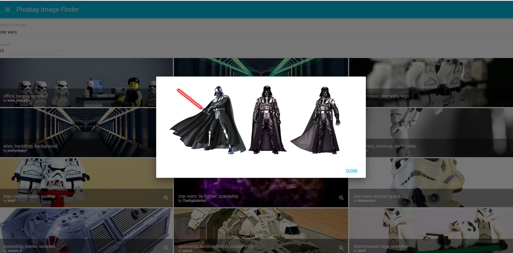

### React & Material UI Project Using The PixaBay API

Site on live:
https://pixabay-image-material-ui-react.netlify.app/

Simple gallery to learn about Pixabay's API and use Material-UI.

### Instalation

To run this project on your machine you first need to clone this repository
$ git clone 

### Install dependencies
npm install

Axios and MateriaL-UI

### Add your Pixabay API key to .env 
 - https://pixabay.com/api/docs/

# Watch CSS & run server on :3000
npm start 

# Build CSS and assets
npm run build

By https://www.youtube.com/channel/UC29ju8bIPH5as8OGnQzwJyA
https://www.youtube.com/watch?v=dzOrUmK4Qyw&list=PLillGF-RfqbY3c2r0htQyVbDJJoBFE6Rb&index=4
